# TMDone Admin Console Playwright Suite

Playwright-based end-to-end automation suite for the TMDone Admin Console. This project covers core admin workflows such as authentication, dashboard validation, reports, stores, offers, campaigns, reels, driver KPI slabs, and TM Done Club analytics.

## System Overview

This automation pack is designed to validate the main operational areas of the admin console:

- Authentication and session handling
- Dashboard widgets, filters, and navigation
- Vendor performance and reporting flows
- Stores and store ratings management
- Offers and order-management journeys
- Portfolio and accounts-management coverage
- Campaigns and Smart Boost workflows
- Reels management
- Driver KPI slab schemes
- TM Done Club analytics and module navigation

The suite is organized as feature-based Playwright specs with reusable helpers for login, page navigation, filters, dialogs, and CRUD flows.

## Application Screenshots

The screenshots below show the main pages covered by the Playwright suite. They are stored under `docs/screenshots/` so the README can act as a quick visual map of the admin console.

### Login

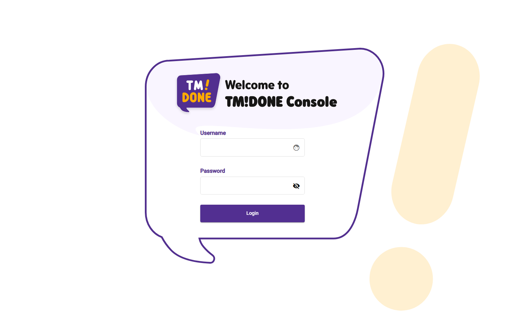

The login page verifies the first user-facing checkpoint of the console. The authentication tests cover required fields, invalid credentials, password visibility, keyboard navigation, and successful sign-in behavior.

### Dashboard

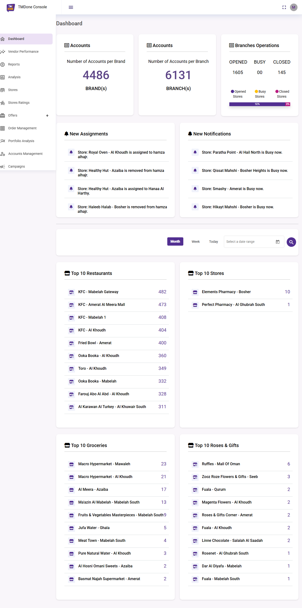

The dashboard is the main landing area after sign-in. Tests validate key summary cards, branch operation counts, assignment and notification panels, date controls, top store lists, sidebar navigation, session handling, and responsive behavior.

### Vendor Performance

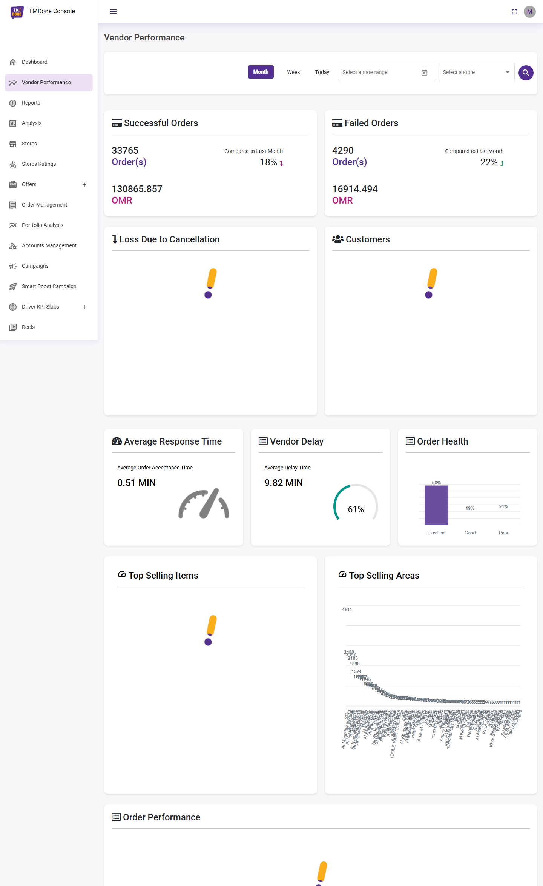

The Vendor Performance page is used to inspect vendor-level operational metrics. The suite checks page loading, headers, filters, date controls, data areas, export actions, row actions, and pagination behavior.

### Reports

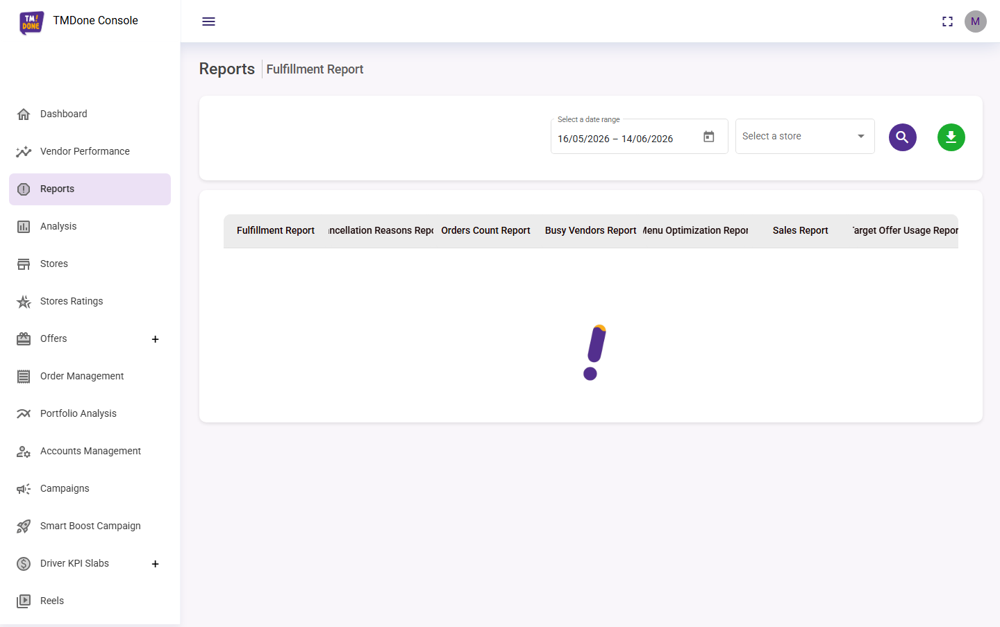

The Reports area groups multiple operational report tabs in one module. Tests cover fulfillment, cancellation reasons, orders count, busy vendors, menu optimization, sales, and target offer usage report flows, including date filters, store filters, tabs, search actions, and downloads.

### Analysis

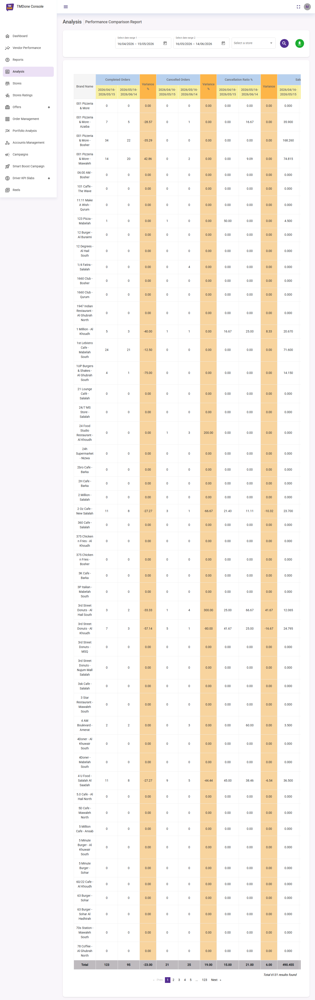

The Analysis page validates performance dashboards and comparison views. The automated checks focus on chart rendering, date controls, store comparison inputs, summary content, and page stability.

### Stores

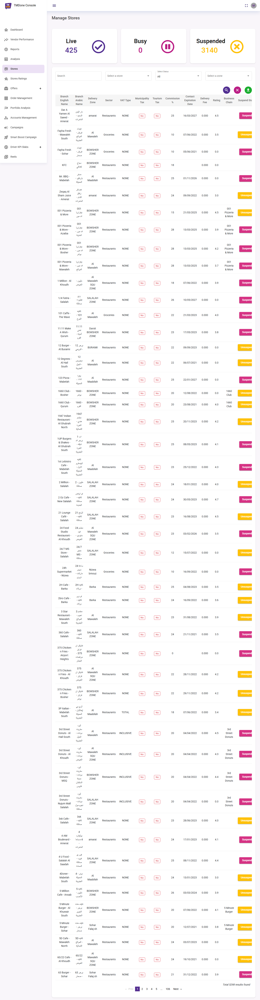

The Stores page covers store search, filtering, data-table validation, status controls, and store detail actions. The tests confirm that the module can load store data, search for records, and handle common management actions safely.

### Store Ratings

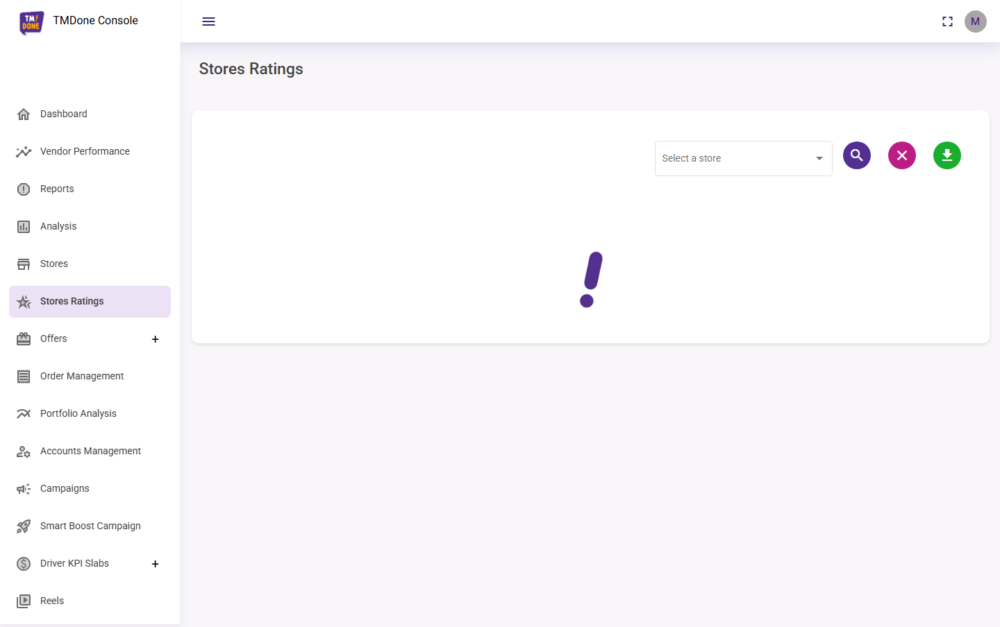

The Store Ratings page is used to filter and export rating records. Tests validate store and rating-type filters, combined search behavior, clear actions, date filters, export behavior, pagination, and first-row detail actions.

### Offers


The Offers page is tested as a full CRUD workflow. Coverage includes creating an offer, searching for it, editing it, deleting it, plus table search, pagination, export availability, and failure handling for incomplete create forms.

### Order Management

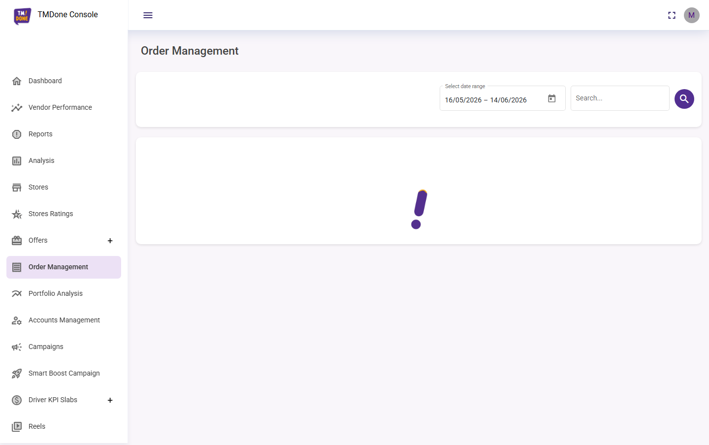

The Order Management page covers order list inspection and operational filters. Tests validate the table shell, status dropdowns, secondary filters, date-range search, text search, clear actions, export behavior, pagination, and view-order action paths.

### Portfolio Analysis

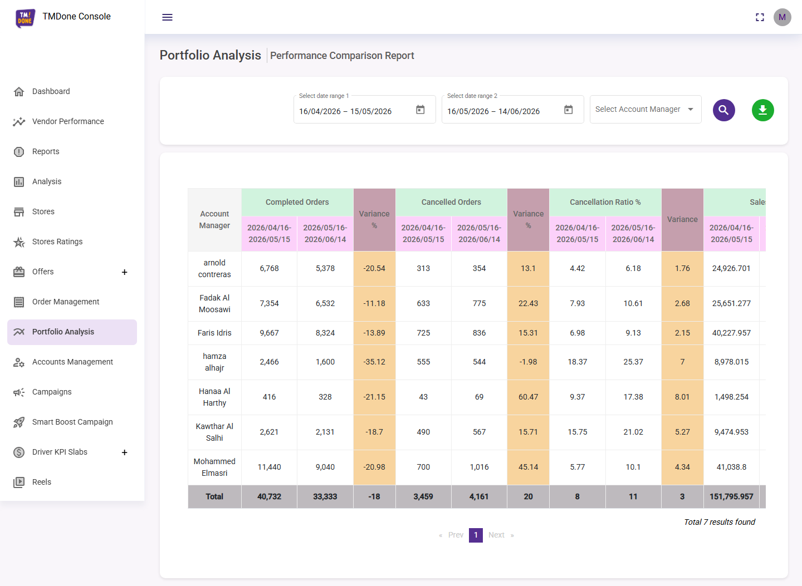

The Portfolio Analysis page focuses on account and portfolio reporting workflows. Tests verify table structure, search behavior, pagination, first-row actions, and download availability where the backend allows it.

### Accounts Management

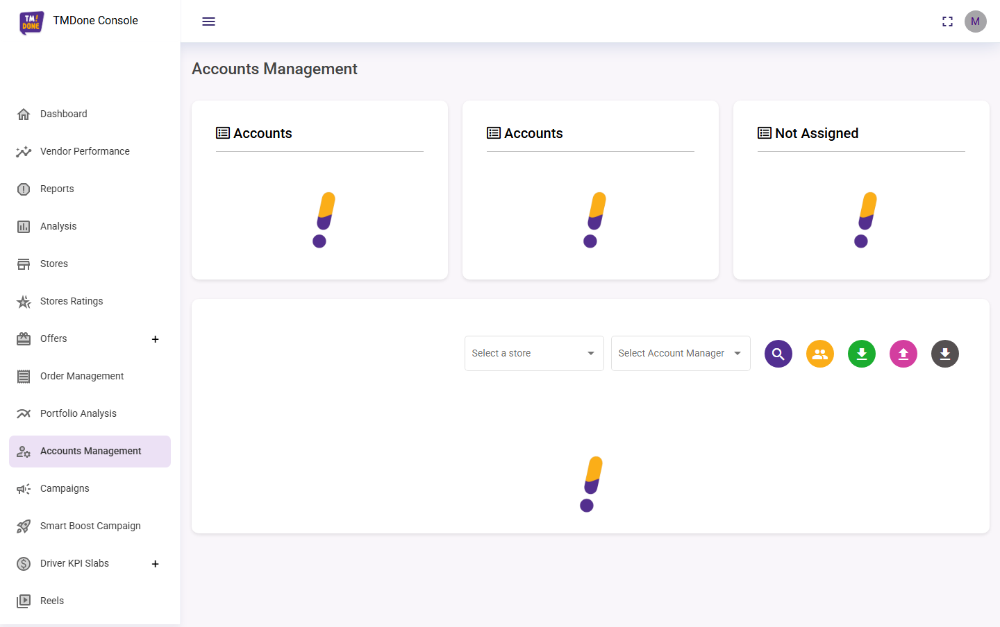

The Accounts Management page validates account search and operational table behavior. Coverage includes filters, table structure, pagination, row edit/action paths, bulk upload selection, account-manager list download, assign actions, and delegate actions.

### Campaigns

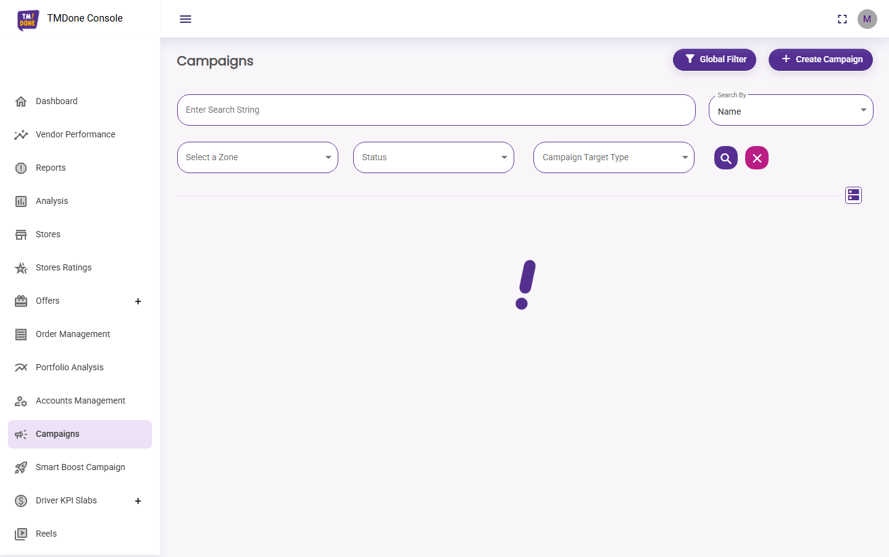

The Campaigns page is one of the largest workflow areas in the suite. Tests cover campaign creation, management, edit and delete flows, promo code configuration, campaign offers, free delivery, store pinning, fixed delivery fee management, filters, search, and pagination.

### Smart Boost Campaign

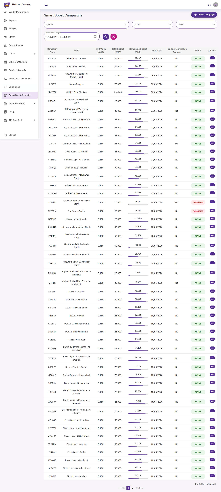

The Smart Boost Campaign page covers boosted campaign management. Tests validate the page shell, filters, search, clear behavior, pagination, creation flow, export availability, row actions, top-up dialogs, and terminate dialogs.

### Driver KPI Slabs

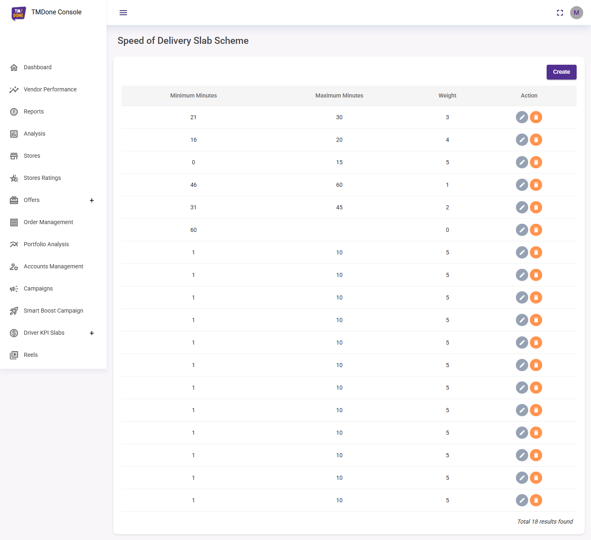

Driver KPI Slabs cover fare-scheme-style configuration pages. The suite validates average attendance, block count, number of fines, redispatch rate, and speed of delivery slab schemes, including create, edit, delete, search, and table behavior.

### Reels

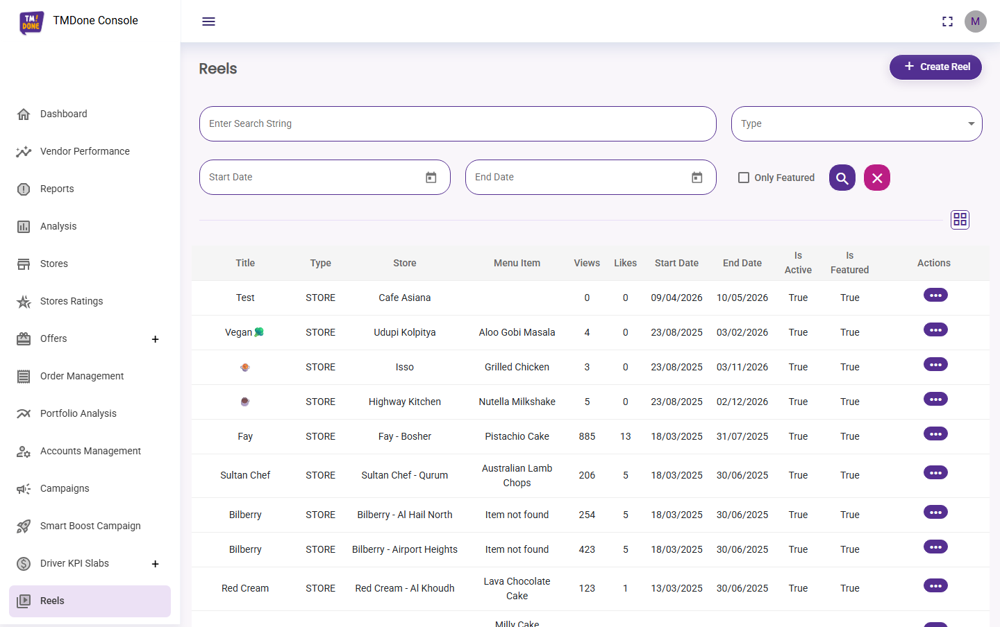

The Reels page tests media-style content management. Coverage includes table loading, create/update/delete flows, multi-step form behavior, upload-area visibility, search, filters, pagination, and row-level actions.

### TM Done Club Analytics

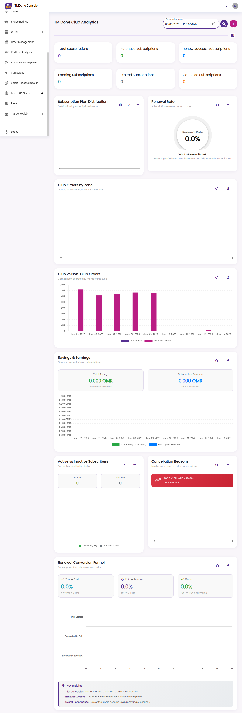

The TM Done Club Analytics page verifies club performance visibility. Tests cover analytics cards, navigation behavior, redirect handling, and module stability for users with varying permissions.

### TM Done Club Plans

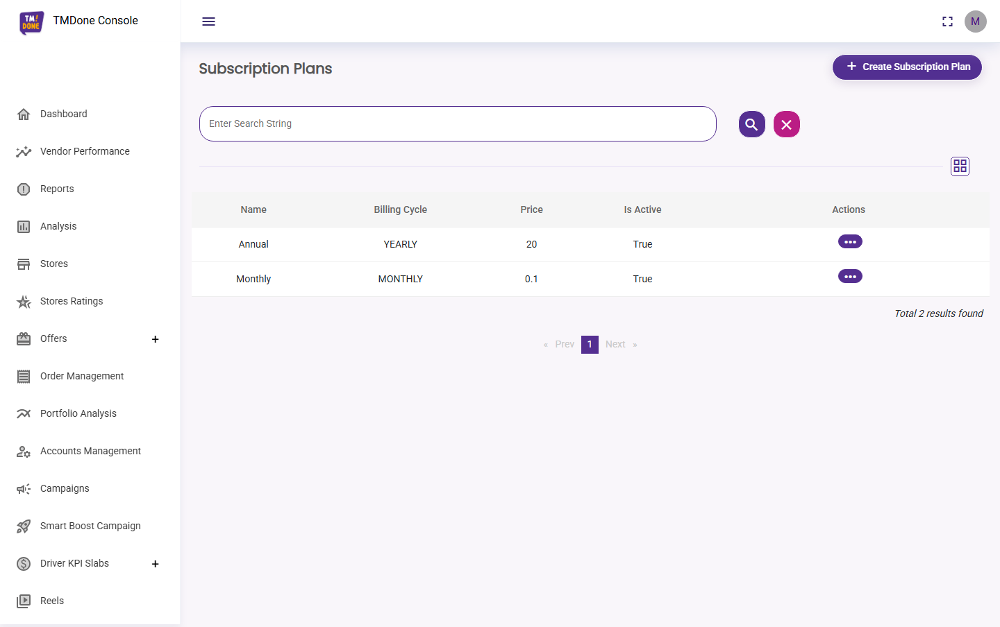

The Subscription Plans page covers plan configuration for club members. Tests validate plan creation, benefit and price fields, updates, deletes, table actions, and safe handling of required fields.

### TM Done Club Subscriptions

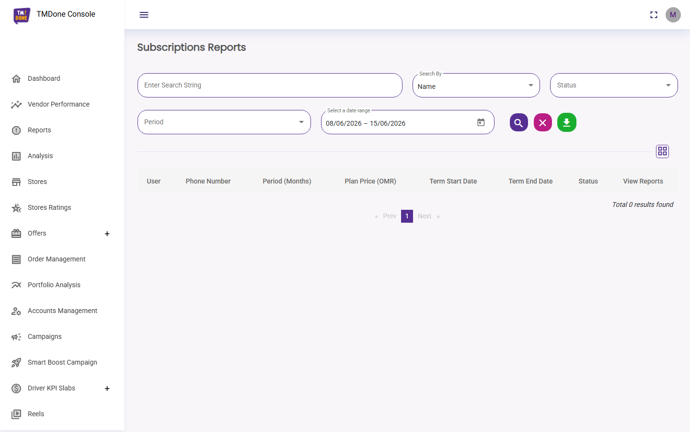

The Subscriptions page focuses on member subscription reporting. Tests validate table visibility, report-style filters, data loading, and navigation inside the TM Done Club module.

### TM Done Club Cancellation Reasons

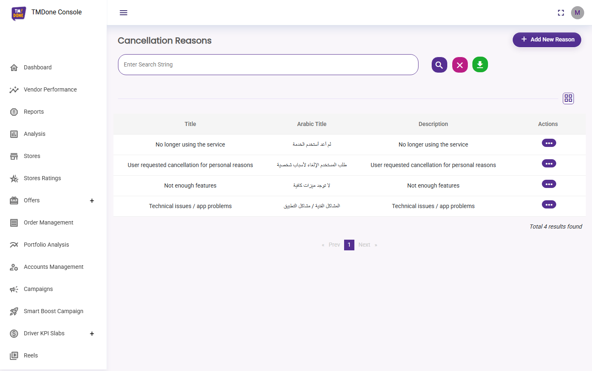

The Cancellation Reasons page covers the configuration and reporting of cancellation reason data. Tests verify page loading, list visibility, create/update/delete paths where available, and stable module navigation.

## Project Structure

```text
tests/
  01-Auth/
  02-Dashboard/
  03-VendorPerformance/
  04-Reports/
  05-Analysis/
  06-Stores/
  07-Stores Ratings/
  08-Offers/
  09-Order Management/
  10-Portfolio Analysis/
  11-Accounts Management/
  12-Campaigns/
  13-Smart Boost Campaign/
  14-Driver KPI Slabs/
  15-Reels/
  16-TM Done Club/
  helpers/
docs/
  screenshots/
scripts/
  capture-readme-screenshots.mjs
playwright.config.js
package.json
```

## Key Test Areas

### Core modules

- `tests/01-Auth`: sign-in validation and authentication checks
- `tests/02-Dashboard`: widget visibility, quick navigation, summary panels
- `tests/03-VendorPerformance`: tables, filters, paging
- `tests/04-Reports`: multiple business reports and export/filter behavior
- `tests/05-Analysis`: analysis dashboards and chart rendering
- `tests/06-Stores`, `tests/07-Stores Ratings`: store operations and ratings views
- `tests/08-Offers`: offer creation and feature validation
- `tests/09-Order Management`: order inspection flows

### Growth and campaign modules

- `tests/12-Campaigns`: campaign creation, edits, deletes, promo code, store pinning, delivery fee management
- `tests/13-Smart Boost Campaign`: Smart Boost flows
- `tests/15-Reels`: reels create, update, delete, and table actions

### Operations and club modules

- `tests/14-Driver KPI Slabs`: slab scheme coverage
- `tests/16-TM Done Club`: analytics, subscription plans, subscription reports, cancellation reasons

## Getting Started

### Prerequisites

- Node.js
- npm
- Playwright browsers

### Install

```bash
npm install
npx playwright install
```

## Running Tests

### Full suite

```bash
npm test
```

### Feature suites

```bash
npm run test:dashboard
npm run test:reports
npm run test:campaigns
npm run test:reels
npm run test:club
```

### Useful modes

```bash
npm run test:headed
npm run test:debug
npm run report
```

### Refresh README screenshots

```bash
node scripts/capture-readme-screenshots.mjs
```

This command signs in to the UAT console and refreshes the screenshots in `docs/screenshots/`.

## Notes

- Credentials and environment-specific routing are handled through shared helpers under `tests/helpers/`.
- Some UAT modules can behave differently depending on permission or backend availability; the TM Done Club suite has explicit handling for those module-level redirects.
- Generated reports and transient test outputs are excluded via `.gitignore`.

## Tech Stack

- Playwright
- JavaScript ES modules
- Node.js

## Maintainer

- GitHub: `lakmal-codezync`
- Email: `lakmal@codezync.com`
